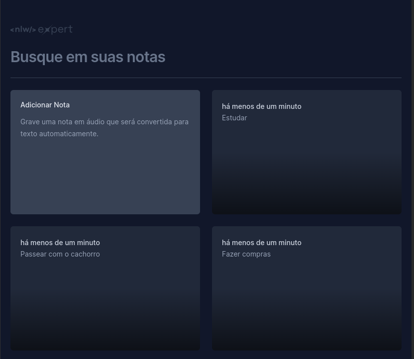

<h1 align="center"> < NLW/ Expert> 🚀</h1>

  <a href="#-tecnologias">Tecnologias</a>&nbsp;&nbsp;&nbsp;|&nbsp;&nbsp;&nbsp;
  <a href="#-projeto">Projeto</a>&nbsp;&nbsp;&nbsp;|&nbsp;&nbsp;&nbsp;
  <a href="#memo-licença">Licença</a>

  

<h2 align="center"> Preview </h2>
  

  

## 🚀 Tecnologias

   
Esse projeto foi desenvolvido com as seguintes tecnologias:  
    
    
    
    

 
## 💻 Projeto

  <ul>
    <li>Autor : <a href="https://github.com/BerserKess">Kesley Rainery</a>
</li>
    <li>
Projeto proposto pela Rocketseat 🚀 que consiste em criar um aplicativo para criar notas com vite e Tailwind.

</li>
   </ul>
   

## 🔧 Recursos e Funcionalidades

    <ul>
        <li>Adicionar notas através da digitação ou voz do usuário
        </li>
        <li>Estilização da aplicação com TailwindCSS
        </li>
         <li>Utilização de bibliotecas para uma maior dinâmica da página
        </li>
    </ul>

## Contribuição

Contribuições são bem-vindas! Se você deseja melhorar este projeto, sinta-se à vontade para fazer um fork do repositório, implementar suas modificações e enviar uma pull request.

